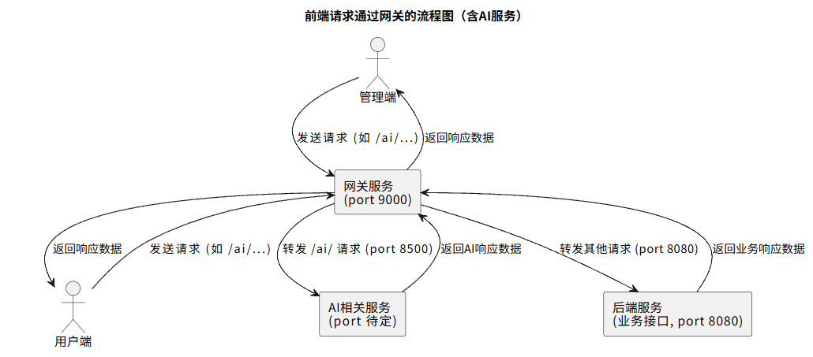

# 网关集成技术方案文档（Spring Cloud Gateway）

## 一、背景说明
当前系统预计由五个模块组成：

- 管理端前端页面（Vue，端口 **8081**）
- 用户端前端页面（Vue，端口 **8083**）
- 后端服务（Spring Boot，端口 **8080**，路径 `/springbootn3op2l20/`）
- 网关服务（Spring Cloud Gateway，端口 **9000**）
- ai服务（端口 **8500（待定）**）

**目标：**
通过网关（端口 9000）统一转发前端请求到后端，后续还将支持 AI 服务接口转发。

---

## 二、采用方式

- 使用 Spring Cloud Gateway 实现统一入口
- 网关监听端口：`9000`
- 所有访问 `/springbootn3op2l20/**` 的请求将由网关转发至 8080 后端服务
- 前端无需调整路径结构，仅修改 baseUrl 指向 `http://localhost:9000/springbootn3op2l20/`

---

## 三、关键配置示例

**`application.yml`：**

```yaml
server:
  port: 9000

spring:
  cloud:
    gateway:
      routes:
        - id: backend-route
          uri: http://localhost:8080
          predicates:
            - Path=/springbootn3op2l20/**
          filters:
            - StripPrefix=0
```

如需转发 AI 模块：

```yaml
        - id: ai-service
          uri: http://localhost:8500
          predicates:
            - Path=/ai/**
```

---

## 四、前端请求路径说明

Vue 管理端（8081）和用户端（8083）中，只需修改 baseUrl：

```js
// config.js
baseUrl: 'http://localhost:9000/springbootn3op2l20/'
```

其余接口保持不变，无需加 /api 前缀。

---

## 五、请求流程图


